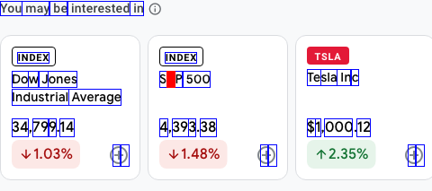
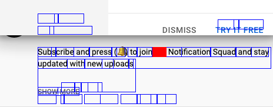

# ImageBert Dataset

### Overview

Large Language models have demonstrated lots of promise in the last few years. A key element of their success is Masked Language Modeling pretraining. However, one severe limitation is that you have to feed in data directly as text. This makes using pdfs and websites, two of the best data sources, difficult.

In this project, I create a distributed web scraper that generates a dataset of (image, word bounding boxes) pairs. The idea is that this could be a good dataset for training these large models to directly ingest image content that is mostly textual.

All text in a random portion of a website is tokenized. Bounding boxes are found around each. A downstream model could potentially mask one box (red box), and then train a model to predict the missing token - in this case “**&**”

### Scraping Routine

This codebase uses [Chromedp](https://github.com/chromedp/chromedp), a golang library which runs headless chrome instances to allow for fast web scraping. To scrape a single web page…

1. One of the headless chrome instances is selected
2. Navigate to the URL
3. Extract all of the text and tokenize it using [gobert](https://github.com/buckhx/gobert) tokenizer.
4. Pair each token to a [javascript Range ](https://developer.mozilla.org/en-US/docs/Web/API/Range)of that text contained within a DOM element
5. Screenshot sequences of text which fit the criteria
6. Extract all URLs and add them to a queue to be scraped

These are the criteria for a screenshot:

* All of the text must be at least 100 pixels tall, and at most 512 x 256 pixels in size.
* It must contain at least ~50 visible tokens

### Scaling up to a Distributed System

Scraping a massive dataset would ideally need to be done by a cluster of scrapers to make things fast enough. Here’s how it works:

There is a single leader which maintains a list of all visited URLs and all URLs which have been queued up to be searched. This leader is an RPC server and worker instances can connect to the leader. The leader will then assign these worker nodes URLs to scrape. If a worker requests a URL, the leader marks this URL as used

Pros:

* An entire scraping job can easily be stopped and resumed based on a two files - one with all of the used URLs and one with all of the queued URLs
* Simple Communication between workers and the leader

Cons:

* The leader is a single point of failure
* A popped URL from the queue is not guaranteed to be processed. On failure, it is simply ignored and marked as used anyway
* Workers do not report back URLs to add to the queue since there are more than enough anyways in the queue.

This was then deployed on two digital ocean droplets, running a [headless shell docker container](https://github.com/chromedp/docker-headless-shell#:~:text=The%20headless%2Dshell%20project%20provides,profiling%2C%20or%20testing%20web%20pages.).

### Challenge: Checking is a token is Visible
By far the most difficult part of this project was checking if an HTML DOM element is visible. Surprisingly, there is no way in vanilla javascript to do this correctly.

**Method 1 - Vanilla Javascript:** Most stackoverflow answers for this problem offer a bunch of javascript heuristics - is the box of the element in the screen? Is the box big enough? Does it have a display None style? Etc.

**Method 2 - IntersectionObserver:** Javascript recently added an IntersectionObserver which supposedly allows you to check if another DOM element is on top of it, which removes the need to traverse up the DOM tree.

**Method 3 - Highlighting and Screenshotting:** The most effective, but atrociously slow method was to screenshot an element, then highlight it as you would in a browser with  _window.getSelection() _and then check to see if there was a pixel difference.

All three methods combined were pretty good, but still imperfect especially on bloated sites that have pushed HTML and CSS to their absolute limits like Youtube and Google. I suspect this problem is indeed pretty intractable, because even chrome shows the hidden text when I ⌘+F.

 Here is a particularly bad example:

On my macbook, using all three methods on an average page takes around 3 minutes each and I can run around 10 in parallel, but on my $5 digital ocean droplets it was not possible to use method 3.

### Dataset Download {#dataset-download}

A sample dataset generated overnight on the $5 droplet, consisting of around 500 images: (using only method 1 and 2 for visibility checking) [https://www.dropbox.com/sh/paabmstks4svwsh/AAAiP8vT9x0vh4M1QnywQkO1a?dl=0](https://www.dropbox.com/sh/paabmstks4svwsh/AAAiP8vT9x0vh4M1QnywQkO1a?dl=0)

For each image in **img/** there is a corresponding csv in **csv/** which contains one line for each token in this image

### Gallery of images run using complete visibility checking

